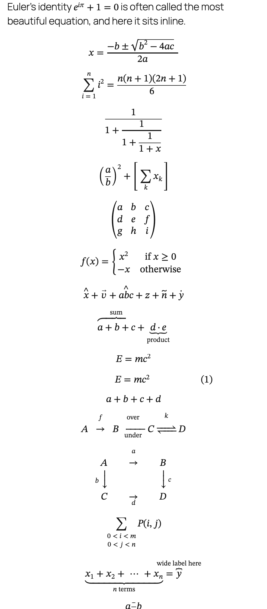
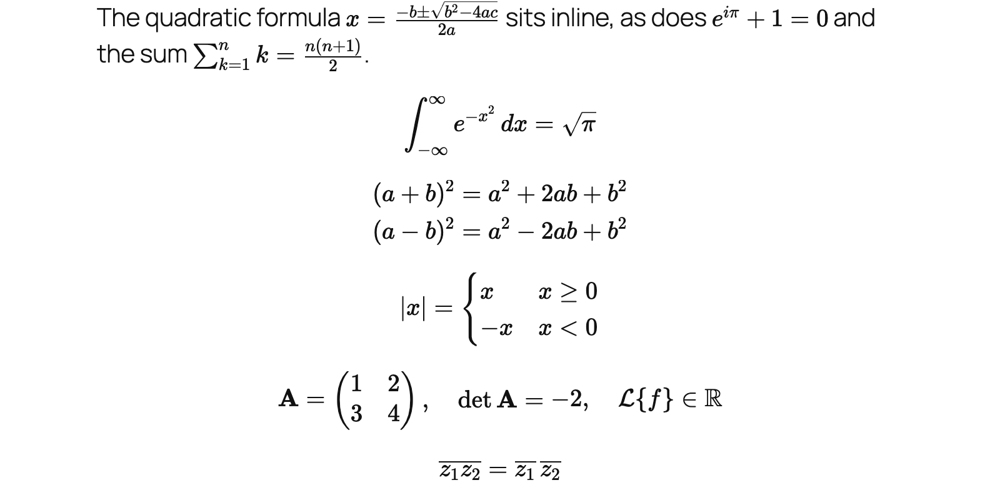
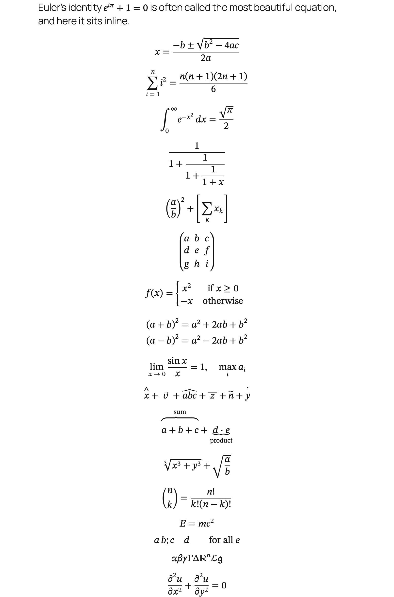
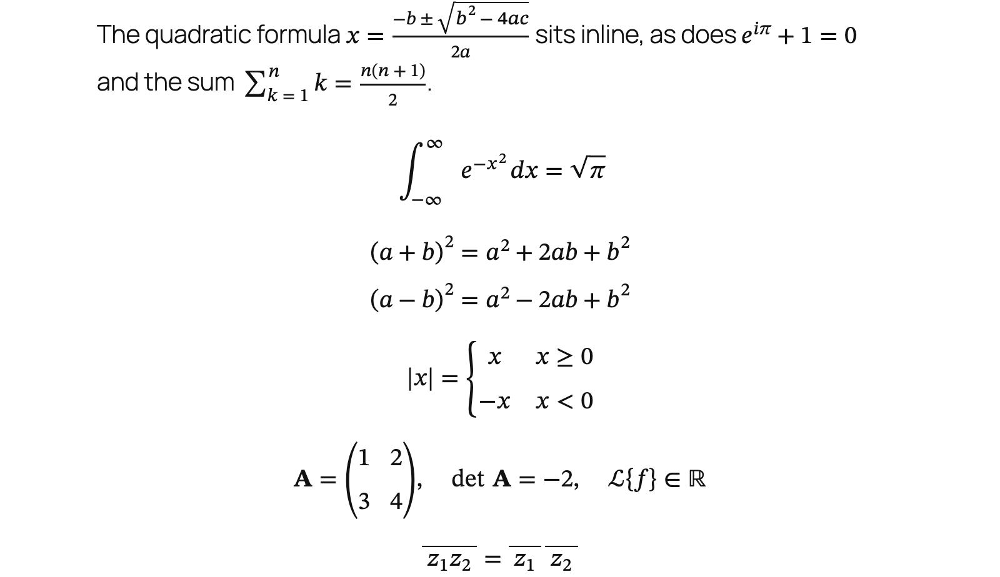
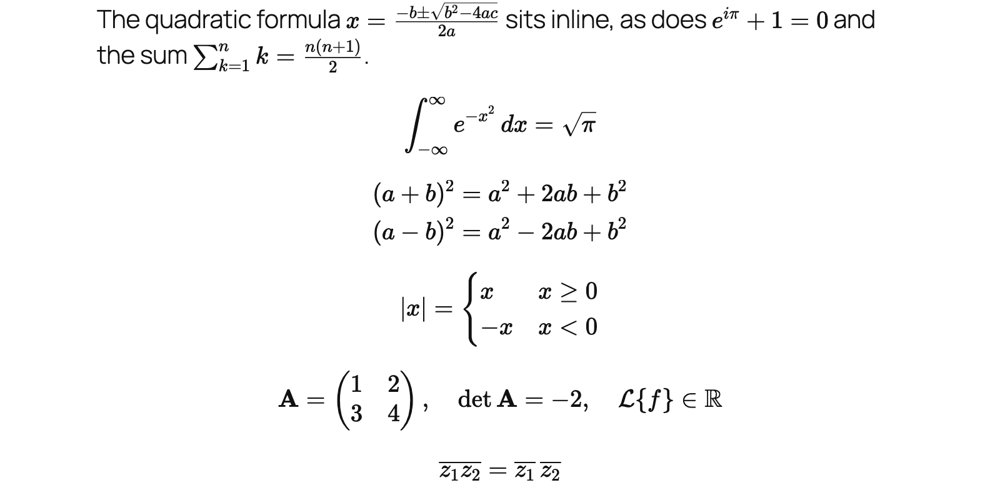

# KaTeX Math Rendering

A WordPress plugin that renders the math of the Math block and the inline math format with [KaTeX](https://katex.org). The saved content stays MathML.

WordPress saves math as MathML, which browsers render on their own and which works in feeds, email and anywhere else the content goes. This plugin is for sites that want KaTeX's typesetting on top of that.

- The content is not changed. Posts keep the MathML, with the LaTeX source inside it. Deactivate the plugin and everything still renders.
- On the front end, KaTeX is loaded only on pages that contain math, and each formula is replaced by its KaTeX rendering.
- In the editor, the Math block and inline math are shown with KaTeX as well. Only the display changes, what is saved stays the same.
- A formula KaTeX cannot render is left to the browser's MathML.
- Formulas keep the size the browser gives MathML, the text size, rather than KaTeX's default enlargement. A theme that wants math larger next to its body font sets `math` and `.katex` alike, for example `math, .katex { font-size: 1.1em; }`.

Requires the Math block and inline math format of WordPress 7.0 or the Gutenberg plugin.

## What it looks like

The same post, as the browser renders the MathML on the left and as KaTeX renders it on the right, at the same font size. Taken with `npm run screenshots` on macOS, where Chrome and Safari use STIX Two Math for the native rendering and Firefox its own layout.

| Browser | Native MathML | KaTeX |
| --- | --- | --- |
| Chrome |  |  |
| Safari |  |  |
| Firefox |  |  |

## Development

There is no build step. KaTeX is vendored in `vendor/katex`; `npm run update-katex [version]` updates it.

The end-to-end tests run against a [wp-env](https://www.npmjs.com/package/@wordpress/env) site with the latest Gutenberg release:

```sh
npm install
npm run wp-env start
npm run test:e2e
```

Point `.wp-env.override.json` at a local Gutenberg checkout to test against trunk.

`npm run screenshots` retakes the images above from the running site, in Chromium, WebKit and Firefox.
