# KaTeX Math Rendering

WordPress supports math out of the box: it writes standard MathML, which the browser renders. These renderings sometimes fall short, with oddly positioned strokes, thicker lines and the like, in the math fonts browsers ship with. This small plugin bundles KaTeX and uses its typesetting on the front end and in the editor, for the WordPress Math block and the inline math format. There are no separate blocks, it is an alternate rendering. To switch back to the WordPress rendering, deactivate the plugin and everything keeps working: Math blocks and inline math stay stored exactly as WordPress stores them, with both the LaTeX and the MathML in the post content.

- On the front end, KaTeX is loaded only on pages that contain math.
- A formula KaTeX cannot render is left to the browser's MathML.
- Formulas keep the size the browser gives MathML, the text size, rather than KaTeX's default enlargement. A theme that wants math larger next to its body font sets `math` and `.katex` alike, for example `math, .katex { font-size: 1.1em; }`.

Requires the Math block and inline math format of WordPress 7.0 or the Gutenberg plugin.

## What it looks like

Each formula as the browser renders the MathML on the left and as KaTeX renders it on the right, at the same font size. Taken with `npm run screenshots` on macOS, where Chrome and Safari use STIX Two Math for the native rendering and Firefox its own layout. The empty native tile for the tagged equation in Safari is what Safari shows: it lays the `\tag` table out a million pixels wide, and the equation ends up far off-screen.

<!-- screenshots:start -->

### Chrome

| LaTeX | Native MathML | KaTeX |
| --- | --- | --- |
| Euler's identity `e^{i\pi} + 1 = 0` is often called the most beautiful equation, and here it sits inline. | 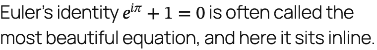 | 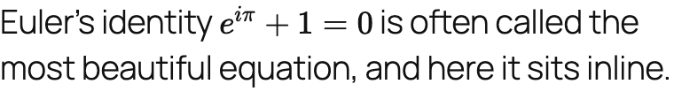 |
| `x = \frac{-b \pm \sqrt{b^2 - 4ac}}{2a}` | 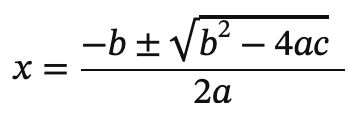 | 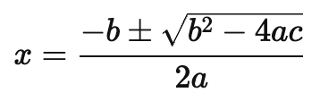 |
| `\sum_{i=1}^{n} i^2 = \frac{n(n+1)(2n+1)}{6}` | 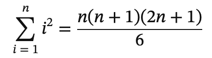 | 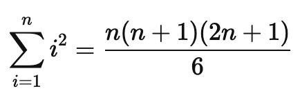 |
| `\cfrac{1}{1 + \cfrac{1}{1 + \cfrac{1}{1 + x}}}` | 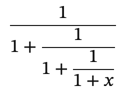 | 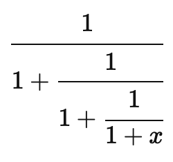 |
| `\left( \frac{a}{b} \right)^{2} + \left[ \sum_{k} x_k \right]` | 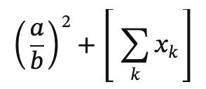 | 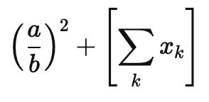 |
| `\begin{pmatrix} a & b & c \\ d & e & f \\ g & h & i \end{pmatrix}` | 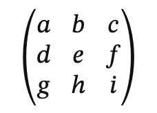 | 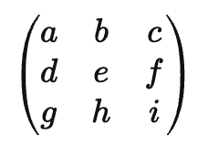 |
| `f(x) = \begin{cases} x^2 & \text{if } x \ge 0 \\ -x & \text{otherwise} \end{cases}` | 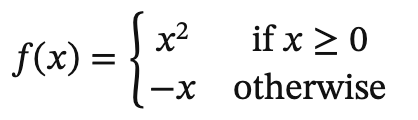 | 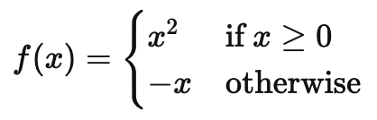 |
| `\hat{x} + \vec{v} + \widehat{abc} + \overline{z} + \tilde{n} + \dot{y}` | 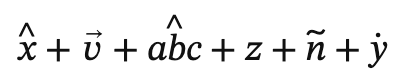 | 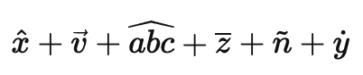 |
| `\overbrace{a + b + c}^{\text{sum}} + \underbrace{d \cdot e}_{\text{product}}` | 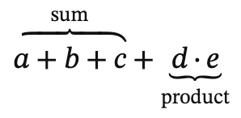 | 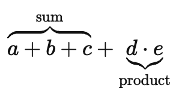 |
| `\boxed{E = mc^2}` | 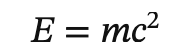 | 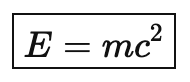 |
| `E = mc^2 \tag{1}` |  |  |
| `\cancel{a} + \bcancel{b} + \xcancel{c} + \sout{d}` | 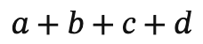 | 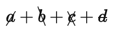 |
| `A \xrightarrow{\;f\;} B \xleftarrow[\text{under}]{\text{over}} C \xrightleftharpoons{k} D` | 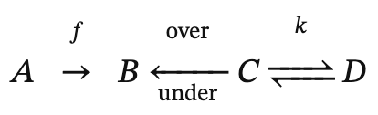 | 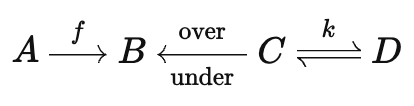 |
| `\begin{CD} A @>a>> B \\ @VbVV @VVcV \\ C @>>d> D \end{CD}` | 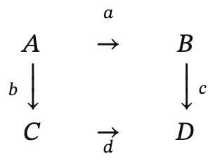 | 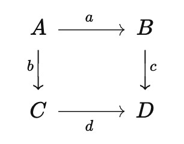 |
| `\sum_{\substack{0 < i < m \\ 0 < j < n}} P(i, j)` | 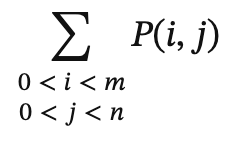 | 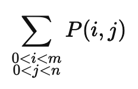 |
| `\underbrace{x_1 + x_2 + \cdots + x_n}_{n \text{ terms}} = \overbrace{y}^{\mathclap{\text{wide label here}}}` | 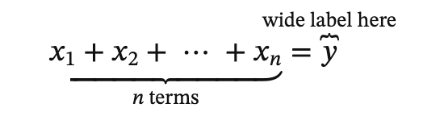 | 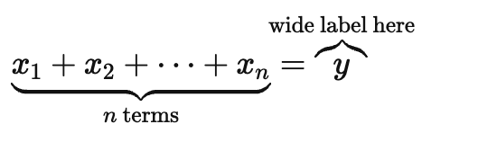 |
| `a \smash{\frac{1}{2}} b` | 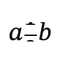 | 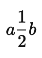 |

### Safari

| LaTeX | Native MathML | KaTeX |
| --- | --- | --- |
| Euler's identity `e^{i\pi} + 1 = 0` is often called the most beautiful equation, and here it sits inline. | 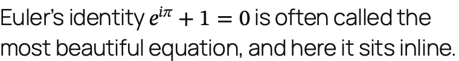 | 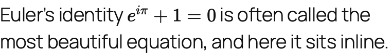 |
| `x = \frac{-b \pm \sqrt{b^2 - 4ac}}{2a}` | 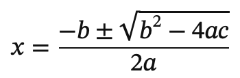 | 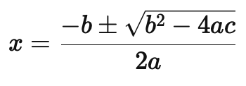 |
| `\sum_{i=1}^{n} i^2 = \frac{n(n+1)(2n+1)}{6}` | 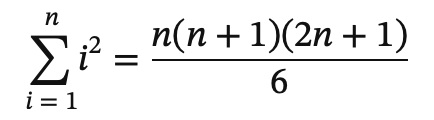 | 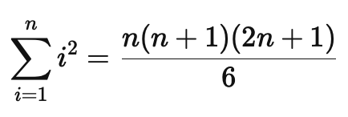 |
| `\cfrac{1}{1 + \cfrac{1}{1 + \cfrac{1}{1 + x}}}` | 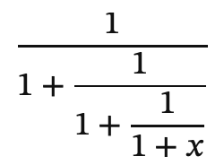 | 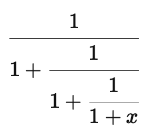 |
| `\left( \frac{a}{b} \right)^{2} + \left[ \sum_{k} x_k \right]` | 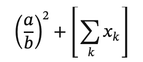 | 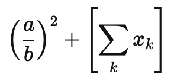 |
| `\begin{pmatrix} a & b & c \\ d & e & f \\ g & h & i \end{pmatrix}` | 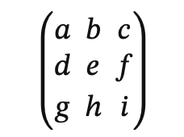 | 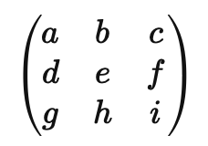 |
| `f(x) = \begin{cases} x^2 & \text{if } x \ge 0 \\ -x & \text{otherwise} \end{cases}` | 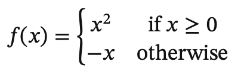 | 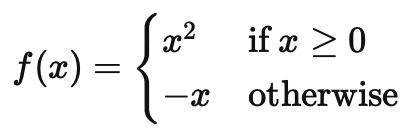 |
| `\hat{x} + \vec{v} + \widehat{abc} + \overline{z} + \tilde{n} + \dot{y}` | 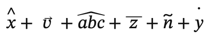 |  |
| `\overbrace{a + b + c}^{\text{sum}} + \underbrace{d \cdot e}_{\text{product}}` | 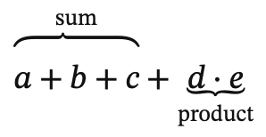 | 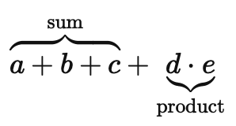 |
| `\boxed{E = mc^2}` | 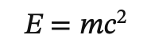 |  |
| `E = mc^2 \tag{1}` |  |  |
| `\cancel{a} + \bcancel{b} + \xcancel{c} + \sout{d}` |  |  |
| `A \xrightarrow{\;f\;} B \xleftarrow[\text{under}]{\text{over}} C \xrightleftharpoons{k} D` |  |  |
| `\begin{CD} A @>a>> B \\ @VbVV @VVcV \\ C @>>d> D \end{CD}` |  |  |
| `\sum_{\substack{0 < i < m \\ 0 < j < n}} P(i, j)` |  |  |
| `\underbrace{x_1 + x_2 + \cdots + x_n}_{n \text{ terms}} = \overbrace{y}^{\mathclap{\text{wide label here}}}` |  |  |
| `a \smash{\frac{1}{2}} b` |  |  |

### Firefox

| LaTeX | Native MathML | KaTeX |
| --- | --- | --- |
| Euler's identity `e^{i\pi} + 1 = 0` is often called the most beautiful equation, and here it sits inline. |  |  |
| `x = \frac{-b \pm \sqrt{b^2 - 4ac}}{2a}` |  |  |
| `\sum_{i=1}^{n} i^2 = \frac{n(n+1)(2n+1)}{6}` |  |  |
| `\cfrac{1}{1 + \cfrac{1}{1 + \cfrac{1}{1 + x}}}` |  |  |
| `\left( \frac{a}{b} \right)^{2} + \left[ \sum_{k} x_k \right]` |  |  |
| `\begin{pmatrix} a & b & c \\ d & e & f \\ g & h & i \end{pmatrix}` |  |  |
| `f(x) = \begin{cases} x^2 & \text{if } x \ge 0 \\ -x & \text{otherwise} \end{cases}` |  |  |
| `\hat{x} + \vec{v} + \widehat{abc} + \overline{z} + \tilde{n} + \dot{y}` |  |  |
| `\overbrace{a + b + c}^{\text{sum}} + \underbrace{d \cdot e}_{\text{product}}` |  |  |
| `\boxed{E = mc^2}` |  |  |
| `E = mc^2 \tag{1}` |  |  |
| `\cancel{a} + \bcancel{b} + \xcancel{c} + \sout{d}` |  |  |
| `A \xrightarrow{\;f\;} B \xleftarrow[\text{under}]{\text{over}} C \xrightleftharpoons{k} D` |  |  |
| `\begin{CD} A @>a>> B \\ @VbVV @VVcV \\ C @>>d> D \end{CD}` |  |  |
| `\sum_{\substack{0 < i < m \\ 0 < j < n}} P(i, j)` |  |  |
| `\underbrace{x_1 + x_2 + \cdots + x_n}_{n \text{ terms}} = \overbrace{y}^{\mathclap{\text{wide label here}}}` |  |  |
| `a \smash{\frac{1}{2}} b` |  |  |

<!-- screenshots:end -->

## Development

There is no build step. KaTeX is vendored in `vendor/katex`; `npm run update-katex [version]` updates it.

The end-to-end tests run against a [wp-env](https://www.npmjs.com/package/@wordpress/env) site with the latest Gutenberg release:

```sh
npm install
npm run wp-env start
npm run test:e2e
```

Point `.wp-env.override.json` at a local Gutenberg checkout to test against trunk.

`npm run screenshots` retakes the images above from the running site, in Chromium, WebKit and Firefox, and rewrites the tables. The formulas are listed in `test/screenshots/formulas.cjs`; after changing the list, regenerate `content.html` with `test/screenshots/build-content.cjs`, run from a directory that has temml installed (a Gutenberg checkout does).
